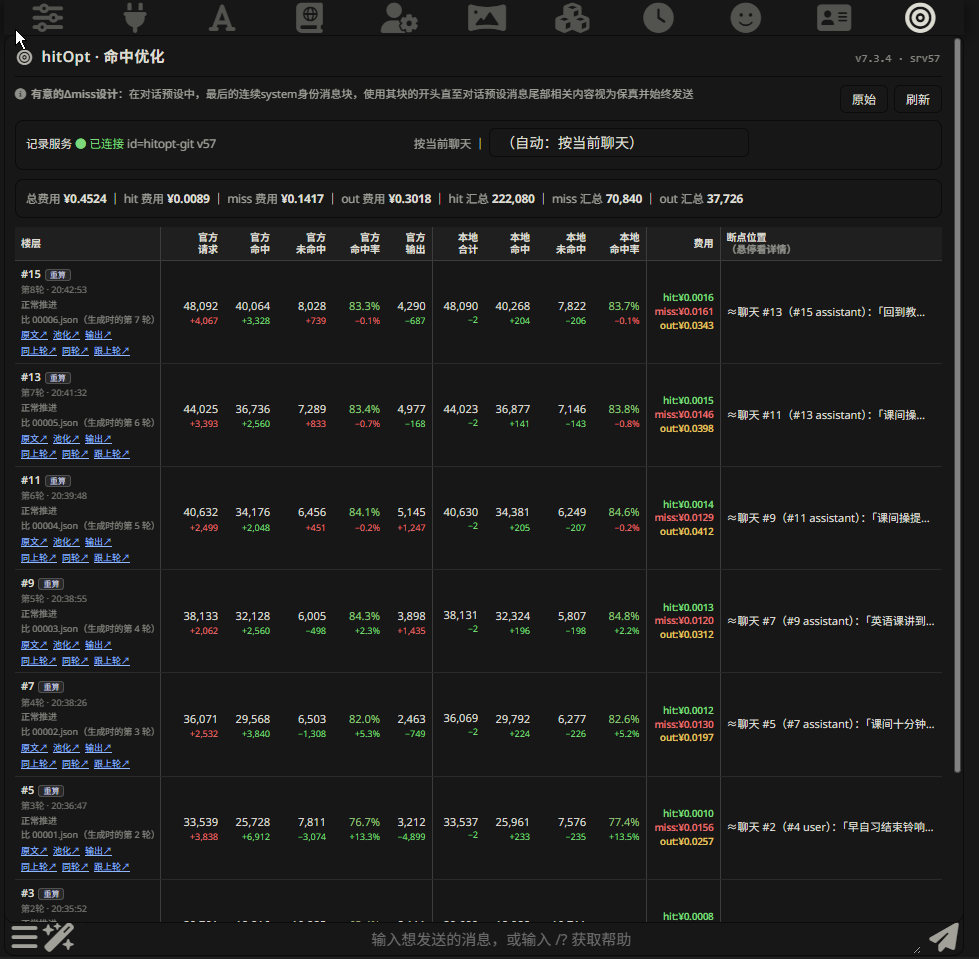
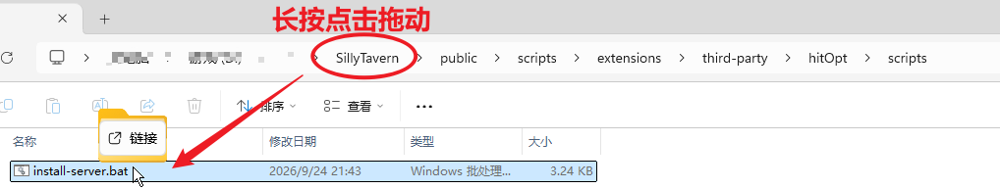

# hitOpt · 命中优化



*面板长这样 —— 每一轮一行：官方命中 / 未命中 / 命中率 / 输出，本地重算值，这一轮花了多少钱，
以及缓存从哪一行断掉。点任意一行的入口就是**逐行差异页**。*

SillyTavern（酒馆）的**缓存命中面板**：把每一轮对话的缓存命中 / 未命中、花了多少钱、
上下文从哪一行断掉，全都摊开给你看，还能点开看**逐行差异**。

它面向按 **prompt caching** 计费的接口（DeepSeek 等）—— 命中便宜、未命中贵，差一个数量级。
它会在后台按"缓存友好"的方式排列你发出去的上下文（这就是省钱的原理），
而你**不需要改任何东西**：世界书、预设、角色卡，一个字都不用动。

## 它管什么

按缓存计费的接口，**命中与未命中差一个数量级** —— 真正要压的是**未命中**那一块。

算法盯两个数（都是**相对上一轮**），而且**每一轮都要过**：

- **Δhit ≥ 0** —— 命中只许涨，任何让它倒退的改动都不会留下。
- **Δmiss < 0** —— 未命中每轮往下压。

不是"调一次看着不错"，而是**每改一次算法就逐轮重验** —— 插件自带重放工具，
在你自己的机器上把这一轮的请求重跑一遍，把"现在的算法"和"当时真发出去的那一发"摆在一起比。


---

## ⚠ 免责声明（用之前请先读这一节）

### 它是「服务端插件」，不是普通的浏览器扩展

装它的第 ③ 步要往 `<酒馆>/plugins/` 里放代码 —— **那些代码在酒馆的服务器进程里运行**，
拿到的是这个 Node 进程的完整权限（读写文件、执行外部命令、拦截出网请求）。
**不是"装个前端小脚本"那么轻。**

### 哪些功能**必须**用到服务器能力

| 功能 | 为什么非服务器不可 |
|---|---|
| **抓包** | 给 `https.request` / `http.request` / 全局 `fetch` **打补丁**（作用于整个酒馆进程），把真正发出去的那个请求体原样截下来 |
| **落盘** | 用 `node:fs` 把每一轮的请求原文、模型返回、分词缓存写进 `plugins/hitopt-git/` —— 浏览器端写不了任意路径 |
| **逐行差异** | 用 `node:child_process` **调用系统里的 `git` 命令**（每场聊天一个本地仓库）做逐字节 diff |
| **面板取数** | 起 HTTP 路由 `/api/plugins/hitopt-git/*`，把上面这些读给页面 |

### 已知风险（如实说，不粉饰）

- **代码是 AI 辅助设计的，没有经过任何安全审计。** 它的目标是"能用、账看得清"，
  而不是"经得起攻击"。可能存在漏洞、边界处理不当、或在你的环境下行为与预期不符 ——
  **请自行评估之后再决定用不用。**
- **读接口没有身份校验。** `/log`、`/flat`、`/res`、`/diff`、`/abc`、`/pool` 这些都是 `GET`
  （酒馆的 CSRF 保护只管 POST / PUT / DELETE）。⇒ **只要你的酒馆能被别人访问到**
  （局域网、公网、端口转发、内网穿透），**别人就能读到你的聊天记录和完整请求原文。**
- **它记录的是你的私密内容。** `plugins/hitopt-git/` 里存着完整的聊天正文、系统提示、
  世界书注入内容、以及模型的原始返回。**不要提交到任何 git 仓库、不要分享给别人、不要放进同步盘。**
- **API Key 不会被记录**（这一条是核过代码的）：抓包只写**请求体**，
  请求头里只读一个自定义标记 —— `Authorization` 头不落盘。
- **卸载不会自动清理数据**：删掉插件目录 ＝ 连记录一起删掉（见下面「卸载」）。

### 用途限定：**本地、单人的聊天辅助**

- ✅ 自己机器上的酒馆，自己一个人用
- ❌ **不要**用于公开服务、多用户共用、当作对外 API
- ❌ **不要**装在能被公网访问到的酒馆上

### 责任

软件按 MIT 许可证「原样」提供，不附带任何担保。因使用它造成的任何损失
（数据丢失、隐私泄露、API 费用等），作者不承担责任。

---

## 面板上是什么

| 列 | 含义 |
|---|---|
| 官方 请求 / 命中 / 未命中 / 命中率 / 输出 | 直接读接口返回的 usage（DeepSeek 系的 `prompt_cache_hit_tokens` 等） |
| 本地 合计 / 命中 / 未命中 / 命中率 | 插件自己按盘上的原文重算的，用来跟官方**对账** |
| 费用 | 这一轮花了多少；面板顶部是全聊天累计（总费用 / hit / miss / out，以及三项的 token 汇总） |
| 断点位置 | 上下文从第几楼开始跟上一轮不一样 —— 缓存就是从那里断的 |

每一行底下挂着两排入口，点开就是**逐行差异页**（逐字节比对，不是估算）：

```
原文↗  池化↗  输出↗            ← 原始信息
同上轮↗  同轮↗  跟上轮↗        ← 对比差异
```

| 入口 | 比的是什么 |
|---|---|
| `原文↗` | 酒馆组装好、**还没被优化动过**的原文 |
| `池化↗` | 优化后**真正发出去**的那份 request 全文 |
| `输出↗` | 模型对那一发的原始返回 |
| `同上轮↗` | 跨轮，两侧都是**原文** |
| `同轮↗` | **同一轮内部**：优化前 ↔ 优化后 |
| `跟上轮↗` | 跨轮，两侧都是**优化后**的产物 |

---

## 装之前

- SillyTavern（近期版本）
- 酒馆所在的机器上有 `git`（酒馆装扩展本身就要用它）
- ⚠ **它是两半**：浏览器端扩展（一键装）＋ 服务端插件（要手动放**一次**）。
  为什么不能一键 —— 见文末最后一节。

---

## 安装

### ① 装扩展

顶栏 **扩展程序** → 右上角 **「安装扩展程序」** → 粘贴这个地址：

```
https://github.com/XieDeWu/hitOpt
```

装完按一次 **F5**。顶栏会多出一个**靶心**图标，那就是它。

### ② 打开服务端插件开关

**先关掉酒馆**，再编辑 `<酒馆>/config.yaml`：

```yaml
enableServerPlugins: true      # ⚠ 默认是 false，必须改成 true
```

### ③ 放服务端插件（唯一一次手动）

扩展装好之后，安装脚本在这里：

```
<酒馆>/public/scripts/extensions/third-party/hitOpt/scripts/install-server.bat
```

- **Windows**：把**酒馆根目录**拖到那个 `.bat` 上。不用另开窗口 ——
  就照下面这样，在地址栏里**按住 `SillyTavern` 那一级往左下方拖**，拖到 `install-server.bat` 上松手：



  松手后会弹出一个黑窗口，它自己建好 `<酒馆>/plugins/hitopt-git/` 并把两个文件放进去
  （**只拷这两个文件，不会动你的任何记录**）。
- **macOS / Linux**：手动把本仓库 `server/` 里的两个文件拷进 `<酒馆>/plugins/hitopt-git/`：

```
<酒馆>/plugins/hitopt-git/
├─ index.mjs      记录服务
└─ wiretap.mjs    抓包
```

> ⛔ **只要这两个文件**。不要删这个目录里已有的 `_gitlog/`、`captures/` —— 那是你的记录，不是安装残渣。

### ④ 启动

开酒馆 → **F5** → 顶栏点靶心。

---

## 怎么算装好了

- 面板第一行的「记录服务」是绿的：**● 已连接 id=hitopt-git**
- 若面板是空的、并且弹过一条"服务端那一半还没装"的提示 ⇒ ② 或 ③ 没做对

---

## 更新

- **扩展**：跟着酒馆的扩展更新走（扩展程序面板里点「更新所有」）。
- **服务端**：⚠ **不会自动更新**。
  酒馆那个"自动更新服务端插件"只对 **git 仓库**生效 —— 加载器对不是仓库的目录是**直接跳过**的
  （`src/plugin-loader.js` 里 `checkIsRepo` 不通过就 `continue`），而服务端是**拷进去的两个文件**。
  ⇒ **每次扩展更新之后，把 ③ 再做一遍**（再拖一次那个 `.bat`），然后重启酒馆。
- 💡 **忘了也没关系**：v7.3.5 起，扩展发现服务端版本落后会**自己弹一条提示**告诉你该重跑那个 bat。

---

## 卸载

1. 在 **扩展程序** 面板里删掉 hitOpt（或直接删目录 `<酒馆>/public/scripts/extensions/third-party/hitOpt/`）
2. 删目录 `<酒馆>/plugins/hitopt-git/`
3. 重启酒馆 ＋ F5

> ⚠ **第 2 步会连你的记录一起删掉** —— 它们就住在那里面：

```
<酒馆>/plugins/hitopt-git/
├─ _gitlog/     每一场聊天的逐轮记录
├─ captures/    每一轮真发出去的请求原文 ＋ 官方返回
├─ _tokcache/   分词缓存
└─ _errlog/     插件自己的异常日志
```

想留着就先把这个目录整个拷出来。

---

## 常见问题

**Q：面板是空的 / 提示记录服务没连上。**
A：服务端那一半没装好。回到 ②③ —— 改完 `config.yaml` **必须重启酒馆**（服务端插件只在启动时加载）。

**Q：装好了，但「官方」那几列是 `—`。**
A：你的接口没返回缓存命中字段。那套字段（`prompt_cache_hit_tokens` / `prompt_cache_miss_tokens`）
是 DeepSeek 系的；别的接口只会有「本地」那几列。两套数是分开算的，缺一套不影响另一套。

**Q：找不到 `install-server.bat`。**
A：它在**扩展目录**里，不在酒馆根目录 ——
`<酒馆>/public/scripts/extensions/third-party/hitOpt/scripts/`。

**Q：它会改我的世界书 / 预设 / 角色卡吗？**
A：不会。它动的是**发出去那一刻的请求体**（池化与重排，省钱的原理就在这儿），
你的设定文件一个字都不动。

---

## 为什么服务端不能一键装（不是这个插件特殊）

酒馆里是**两套互不相干的加载系统**：

| | 从哪加载 | 怎么装 |
|---|---|---|
| 浏览器端扩展 | `<酒馆>/public/scripts/extensions/third-party/` | 「输入 Git URL」一键装 |
| 服务端插件 | `<酒馆>/plugins/` | **只能手动放** —— 加载器只有一句 `readdirSync`，没有任何下载机制 |

而这个插件的核心 —— 把**真发出去的那个请求**截下来、落盘、跑 git diff —— **必须在服务端做**
（要 Node 的文件系统与传输层，浏览器端做不到）。

所以"只输一个 Git 地址就全装好"在酒馆里做不到，**对任何服务端插件都一样**。

---

## 许可

MIT，见 [`LICENSE`](LICENSE)。
